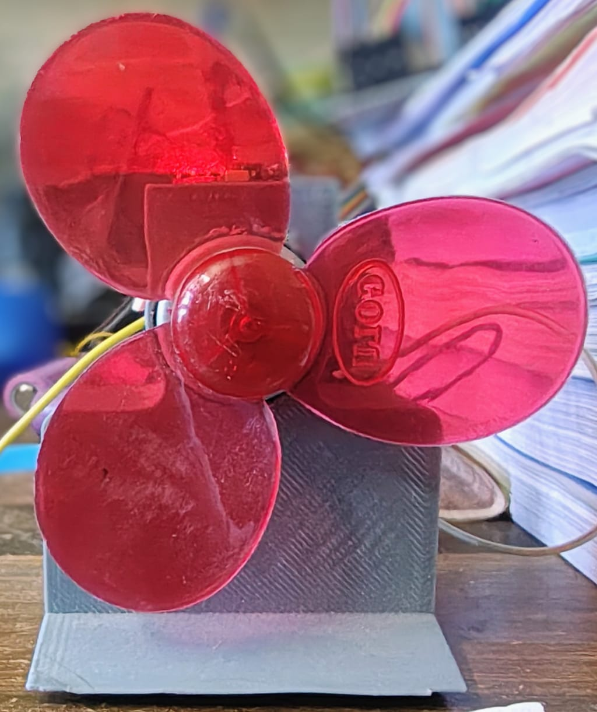
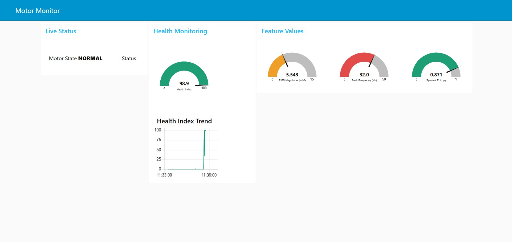
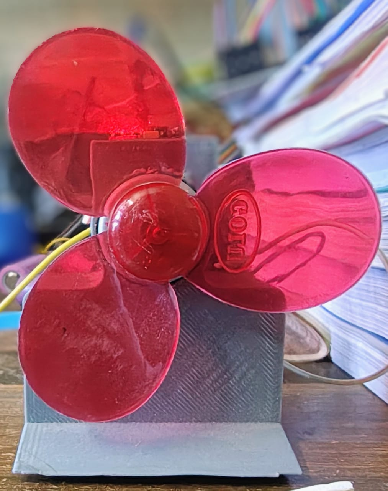
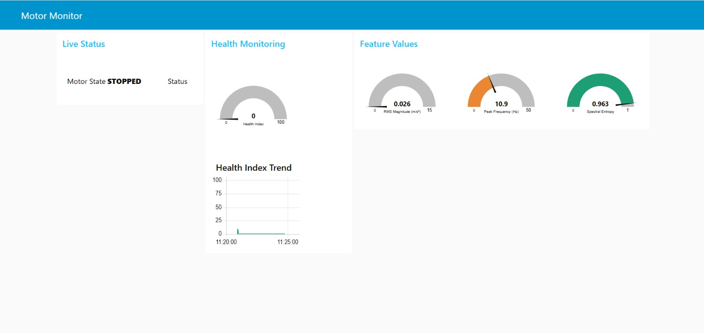
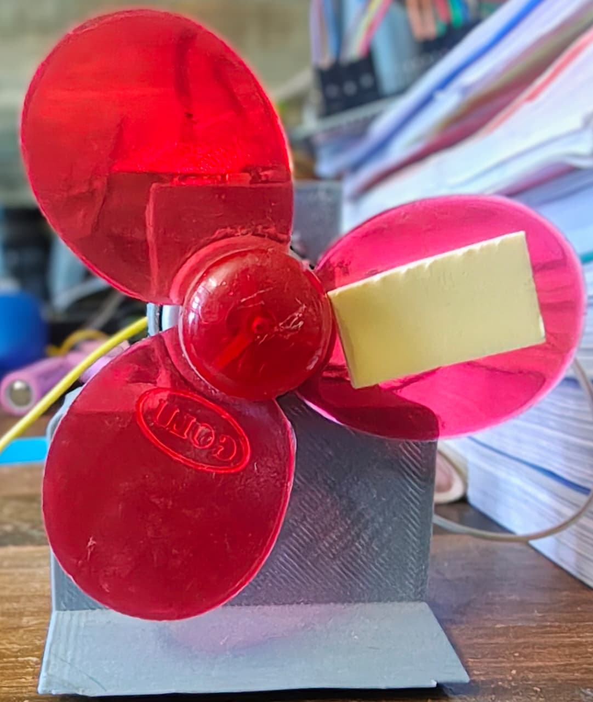
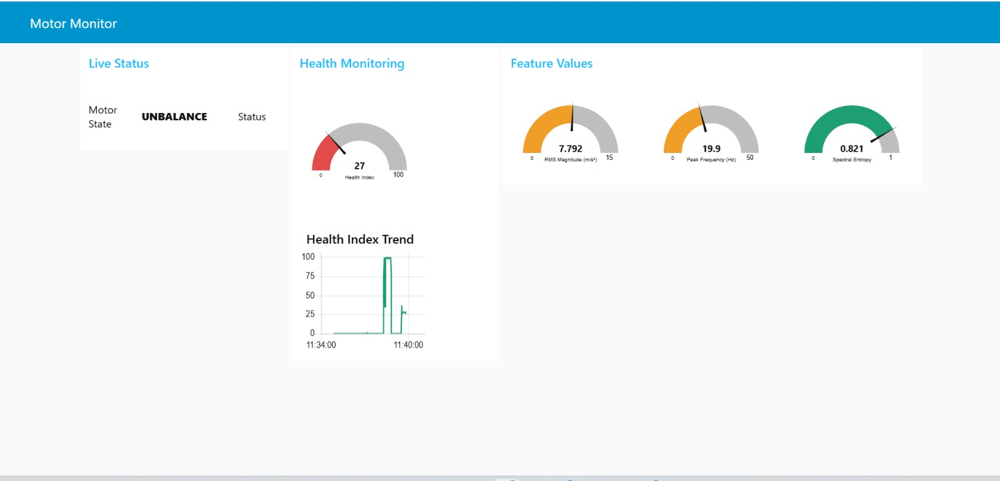
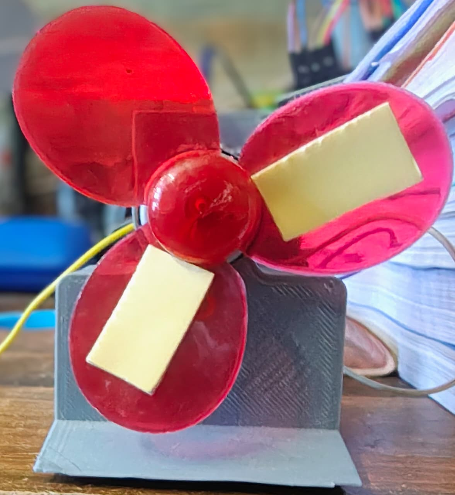
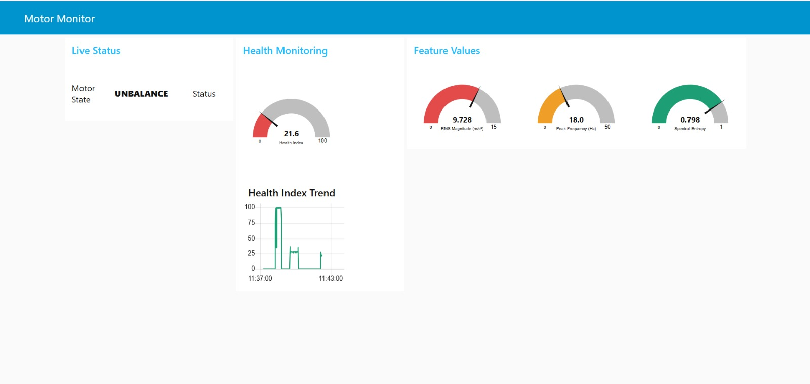

# Edge AI Motor Predictive Maintenance

A complete end-to-end predictive maintenance system for DC motors that performs real-time fault classification entirely on a $5 ESP32 microcontroller — no cloud dependency for inference.

Vibration data from an MPU-6050 MEMS accelerometer is processed through a DSP pipeline, features are extracted, and an XGBoost classifier predicts the motor health state in under 1 ms. Results are encrypted using ASCON-128 lightweight authenticated encryption and published to a cloud MQTT broker for real-time dashboard visualization in Node-RED.

**Author:** Himanshu Patel

---

## System Architecture

```
MPU-6050 (100 Hz)
        │
        │ I2C
        ▼
  ESP32 Dev Module
        │
        ├─ Core 0: Sensing Task (Priority 4)
        │     DC removal → IIR low-pass → sensor queue
        │
        └─ Core 1:
              ├─ Inference Task (Priority 3)
              │     Feature extraction → XGBoost predict → health index
              │
              ├─ Encryption Task (Priority 2)
              │     ASCON-128 authenticated encryption
              │
              └─ MQTT Task (Priority 1)
                    WiFi → broker.hivemq.com → Node-RED dashboard
```

---

## Motor States & Results

### Normal Operation
Motor running freely with no added weight — balanced rotation, high health index.

| Motor | Dashboard |
|:---:|:---:|
|  |  |

**Health Index: 98.9 / 100** — RMS Mag: 5.543 m/s² · Peak Freq: 32.0 Hz · Spectral Entropy: 0.871

---

### Motor Stopped
Motor powered off — no vibration, health index drops to zero.

| Motor | Dashboard |
|:---:|:---:|
|  |  |

**Health Index: 0 / 100** — RMS Mag: 0.026 m/s² · Peak Freq: 10.9 Hz · Spectral Entropy: 0.963

---

### Minor Unbalance
One small weight added to one blade — slight vibration increase, moderate health drop.

| Motor | Dashboard |
|:---:|:---:|
|  |  |

**Health Index: 27 / 100** — RMS Mag: 7.792 m/s² · Peak Freq: 19.9 Hz · Spectral Entropy: 0.821

---

### Major Unbalance
Two large weights added to two blades — severe vibration, health index critically low.

| Motor | Dashboard |
|:---:|:---:|
|  |  |

**Health Index: 21.6 / 100** — RMS Mag: 9.728 m/s² · Peak Freq: 18.0 Hz · Spectral Entropy: 0.798

---

## Demo Video

*Coming soon — link will be added once available.*

---

## Hardware Components

| Component | Description |
|---|---|
| ESP32 Dev Module | Main microcontroller (dual-core, 240 MHz) |
| MPU-6050 | 3-axis MEMS accelerometer + gyroscope (I2C) |
| Buck Converter | Steps down supply voltage for stable 3.3V/5V rail |
| Battery | Portable power supply |

---

## Features

- **On-device inference** — XGBoost model runs entirely on ESP32, no cloud needed
- **Real-time DSP** — DC removal + 2nd-order Butterworth IIR low-pass filter at 100 Hz
- **3-class fault detection** — Normal / Stopped / Unbalance
- **Health Index** — Continuous 0–100 score reflecting motor condition
- **Lightweight encryption** — ASCON-128 authenticated encryption (NIST standard) before transmission
- **MQTT telemetry** — Publishes state, health index, features, and encrypted payload to HiveMQ
- **Node-RED dashboard** — Real-time visualization of all metrics
- **FreeRTOS multitasking** — Four independent tasks pinned across both ESP32 cores

---

## Software Pipeline

### 1. Sensing (Core 0 — Priority 4)
Reads accelerometer at 100 Hz over I2C. Applies DC offset removal and IIR low-pass filtering before pushing samples to a FreeRTOS queue.

### 2. Inference (Core 1 — Priority 3)
Accumulates a 200-sample window (50% overlap). Extracts 12 features:

| # | Feature |
|---|---|
| 0 | RMS X-axis |
| 1 | RMS Y-axis |
| 2 | RMS Z-axis |
| 3 | RMS Magnitude |
| 4 | Kurtosis Y |
| 5 | Skewness X |
| 6 | Skewness Y |
| 7 | Peak Frequency (Hz) |
| 8 | Band Energy 0–10 Hz |
| 9 | Band Energy 10–50 Hz |
| 10 | Crest Factor |
| 11 | Spectral Entropy |

Features are scaled using a pre-fitted StandardScaler, then passed to the XGBoost classifier (300 trees, 3 classes).

### 3. Encryption (Core 1 — Priority 2)
Builds a JSON payload and encrypts it with ASCON-128 using a 16-byte secret key and an incrementing nonce. Output is transmitted as `nonce:ciphertext` in hex.

### 4. MQTT (Core 1 — Priority 1)
Publishes four topics to `broker.hivemq.com`:

| Topic | Content |
|---|---|
| `himanshu_motor/state` | Fault class string |
| `himanshu_motor/health_index` | Health score (0–100) |
| `himanshu_motor/features` | JSON with rms_mag, peak_freq, entropy |
| `himanshu_motor/data` | ASCON-128 encrypted payload (hex) |

---

## Getting Started

### Prerequisites
- Arduino IDE 2.x with ESP32 board support installed
- Libraries: `PubSubClient`, `Wire` (built-in)

### Setup
1. Clone this repository
2. Open `Motor_prediction_project.ino` in Arduino IDE
3. Edit the configuration section at the top of the `.ino` file:
   ```cpp
   #define WIFI_SSID      "your_wifi_ssid"
   #define WIFI_PASSWORD  "your_wifi_password"
   #define MQTT_CLIENT_ID "your_unique_client_id"
   ```
4. Change the ASCON key to your own 16-byte secret
5. Flash to your ESP32

### Node-RED
Import the flow into Node-RED and subscribe to the MQTT topics listed above. Connect to `broker.hivemq.com:1883`.

---

## Project Structure

```
Motor_prediction_project/
├── Motor_prediction_project.ino   # Main firmware
├── classifier.h                   # Auto-generated XGBoost model (300 trees)
├── scaler.h                       # StandardScaler parameters
├── iir_filter.h                   # IIR filter + DC removal
├── ascon128.h                     # ASCON-128 encryption implementation
└── README.md
```

---

## License

MIT License — free to use, modify, and distribute with attribution.
